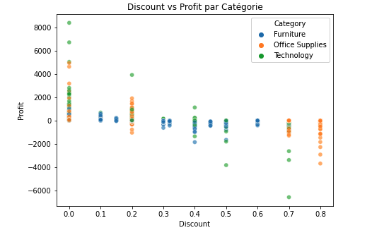

# 📊 Analyse des facteurs influençant les performances commerciales

## 🎯 Objectif du projet

Comprendre les interactions entre ventes, remises, volume et rentabilité afin d’identifier les leviers d’optimisation stratégique.

L’objectif est d’analyser :

- Les relations entre variables quantitatives (Sales, Profit, Discount, Quantity)
- L’impact des remises sur la rentabilité
- Les différences régionales
- Les spécificités par catégorie de produits

Dataset utilisé : **Superstore Dataset**

---

## 🛠 Méthodologie

- Analyse bivariée descriptive (corrélations)
- Visualisations : scatter plots, heatmap
- Segmentation par région
- Segmentation par catégorie
- Analyse stratégique des remises

---

## 📉 Relation entre Discount et Profit

L’analyse montre une corrélation négative entre Discount et Profit :

- **Corr(Discount, Profit) = -0.22**
- Les remises ont un impact négatif sur la rentabilité

---

## 📊 Matrice de corrélation

La matrice de corrélation met en évidence :

- **Sales ↔ Profit : 0.48 (relation modérée positive)**
- **Discount ↔ Profit : -0.22 (impact négatif)**
- **Discount ↔ Quantity : ~0 (aucun effet volume significatif)**

---

## 🌍 Analyse régionale

La région **Central** présente :

- La marge moyenne la plus faible
- Le profit moyen le plus faible
- La remise moyenne la plus élevée (~24%)

---

## 📦 Analyse par catégorie

La catégorie **Furniture** est la plus sensible aux remises :

- **Corr(Discount, Profit) = -0.48**

En région Central :

- Remise moyenne sur Furniture ≈ **30%**
- Soit près du double des autres régions

---

## 💡 Insight stratégique clé

Les remises :

- N’augmentent pas significativement le volume (**Corr ≈ 0**)
- Dégradent la rentabilité
- Sont particulièrement destructrices sur Furniture en région Central

La combinaison :

> Remises élevées + Catégorie sensible = Destruction de marge

---

## 🚀 Recommandations

- Réduire les remises sur Furniture en région Central
- Introduire un plafond de remise
- Mettre en place un suivi mensuel des marges par région
- Tester une stratégie promotionnelle différenciée

---

## 📁 Structure du projet
projet3_performance_commerciale/
│
├── data/ → Dataset
├── notebooks/ → Analyse complète en Python
├── images/ → Visualisations exportées
└── README.md

---

## 🧰 Outils utilisés

- Python
- Pandas
- Seaborn
- Matplotlib
- Analyse statistique (corrélations)
